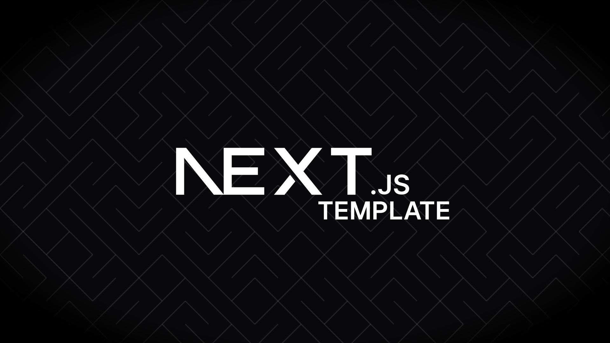

# Next LP Template

---

A simple, scalable and powerful template for building production ready NextJS landing pages.

## Table of Contents

- [Application Overview](docs/application-overview.md)
- [Project Configuration](docs/project-configuration.md)
- [Style Guide](docs/style-guide.md)
- [Project Structure](docs/project-structure.md)
- [API Layer](docs/api-layer.md)
- [Error Handling](docs/error-handling.md)
- [Deployment](docs/deployment.md)

## Contributing

Contributions are always welcome! If you have any ideas, suggestions, fixes, feel free to contribute. You can do that by going through the following steps:

1. Clone this repo
2. Create a branch: git checkout -b your-feature
3. Make some changes
4. Test your changes
5. Push your branch and open a Pull Request

## License

[MIT](LICENSE)
